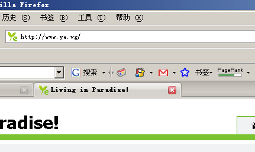

早上一上线，朋友就和我说，这个站的pr到7了 赶紧看了下，果然。新一轮的pr更新开始了。朋友说，他早上查还是5，也是别人和他说，这个站到7，他赶紧查了下果然是。他自己的也到7了。自此，外链中，有3个到了7，太暴力了

PR值全称为PageRank，PageRank(网页级别)是Google用于评测一个网页“重要性”的一种方法。pr值最高为10，不过拿到10的站极少，记得就google自己，连yahoo，microsoft之类都只有9。国内最高的记得就是那个miibeian.gov.cn了，最高到达过9。163，sina，sohu之类都只有过7。简单来说，pagerank引用的是类论文算法，某篇论文被其他论文引用的次数越多，证明此论文权威性越高。某站被其他站链接的次数越多（也就是投票越多），证明次站权威性越高，而在检索时候，排名越能靠前。每级数字之间的权威性，并不是1这么简单，而是类似地震登记，数字高1，权威性高好些倍。

等更新完看看结果了，估计最近toolbar的算法又改了，在好些站查pr预测或者当前值，很多站都有错误。
